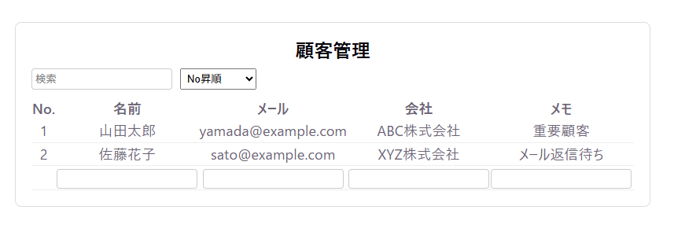
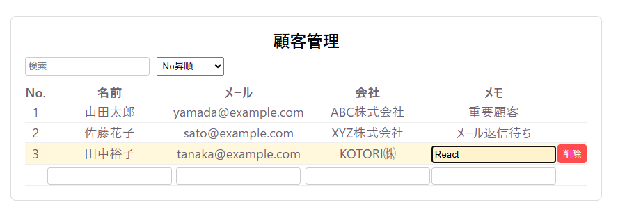

# react-portfolio1
Customer management CRUD app built with React and TypeScript


# 顧客管理アプリ（React + TypeScript）

## 🔗 デモ

https://react-portfolio1-lime.vercel.app/

---

## 📝 概要

顧客情報の登録・編集・削除・検索・並び替えができるCRUDアプリです。
実務を想定し、「状態管理」「UI分離」「操作性」を意識して設計しています。

---

## 📸 スクリーンショット

※ここに画像を追加（GitHubにアップして貼る）

例：



---

## 🚀 使用技術

* React（関数コンポーネント / Hooks）
* TypeScript（型安全な設計）
* Vite（開発環境）
* CSS（インラインスタイル）

---

## ✨ 機能

* 顧客一覧表示
* 新規登録（Enter / フォーカスアウト対応）
* インライン編集（クリックで編集開始）
* 削除（確認モーダル付き）
* 検索（リアルタイム）
* ソート（複数条件）
* トースト通知（成功 / エラー）

---

## 🧠 設計のポイント

### ① コンポーネント分割

UIごとに責務を分離

* CustomerTable：表示ロジック
* DeleteModal：確認UI
* Toast：通知UI

### ② 状態管理の集約

状態とビジネスロジックは `App.tsx` に集約
→ 挙動の追跡をしやすく

### ③ 型定義の分離

`types.ts` に集約
→ 可読性・保守性向上

---

## 💡 工夫した点

* 編集時に変更がない場合はAPIを呼ばない
* 入力途中の誤操作を防ぐフォーカス制御
* メール形式のバリデーション
* UIフィードバック（トースト通知）

---

## 📂 ディレクトリ構成

```text
src/
  App.tsx
  api.ts
  types.ts
  styles.ts
  components/
    CustomerTable.tsx
    DeleteModal.tsx
    Toast.tsx
```

---

## ⚙️ セットアップ

```bash
npm install
npm run dev
```

---

## 📈 今後の改善

* カスタムフック化（useCustomers）
* APIエラーハンドリング強化
* スタイリング改善（CSS Modules / Tailwind）
* ページネーション対応
* テスト導入（React Testing Library）

---

## 👤 想定利用シーン

* 小規模な顧客管理
* 管理画面UIのサンプル
* フロントエンドの基本設計の学習

---

## 📌 一言でいうと

「シンプルだけど、実務を意識した作りのCRUDアプリ」
